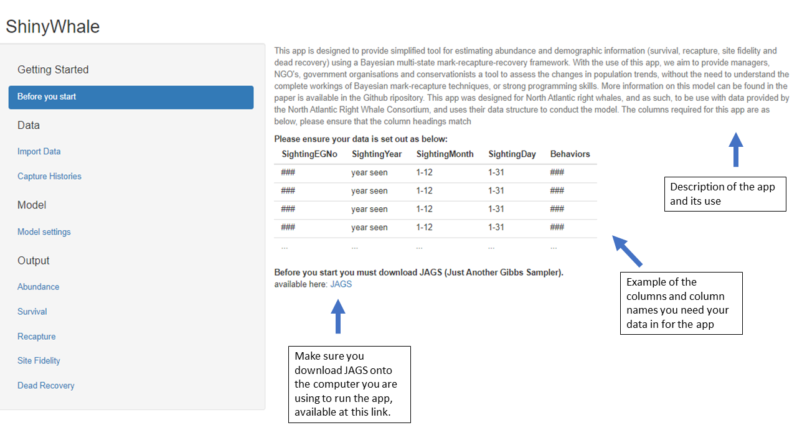
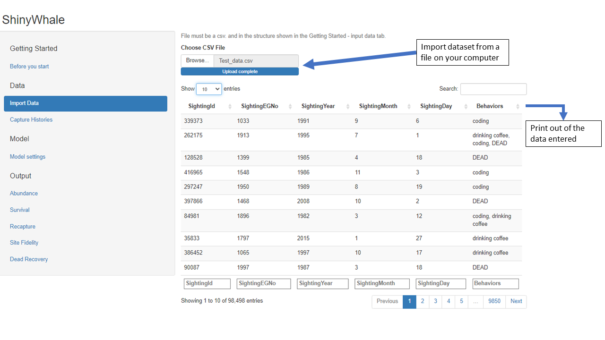
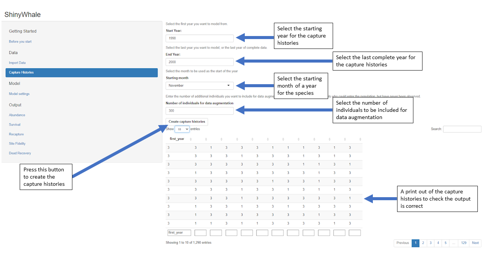
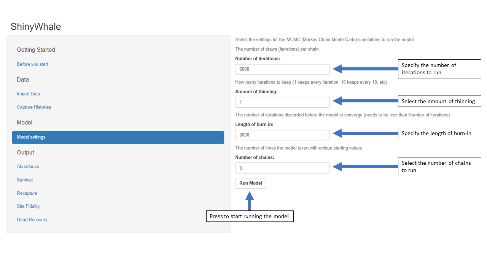
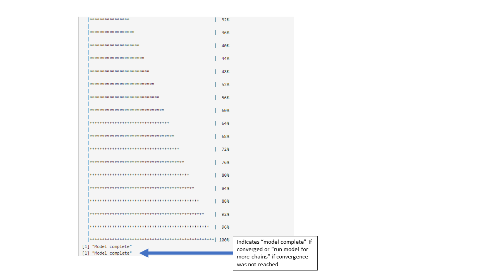
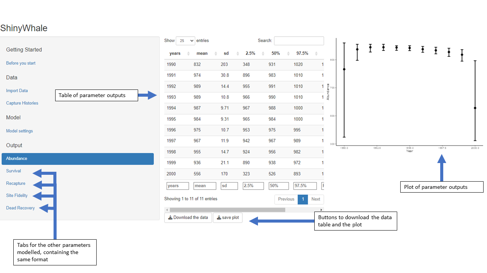

# ShinyWhale

--------------------------------------------------------------------------------------------------------------------------------------------------------------------------------------------------------

A tool for estimating abundance and demographic parameters using a Bayesian multi-state mark-recapture-recovery framework.

### Overview

--------------------------------------------------------------------------------------------------------------------------------------------------------------------------------------------------------

Management and conservation efforts require accurate and up to date estimates of abundance and demographic parameters (i.e. survival and recapture probabilities) to evaluate the species conservation
status, changes in temporal trends and evaluate management actions. The NARW has a long-term photo-identification database maintained by the North Atlantic Right Whale Consortium (NARWC), which
contains information on sightings (location, year, month), calvings and deaths. The ShinyWhale App was designed as a simple tool that can be used by non-statistical ecology experts to provide
estimates of abundance and demographic parameters when data is available.

ShinyWhale was designed with several goals:

-   Allow for fast estimates of abundance and demography for right whales

-   Provide a user-friendly format

-   Offer transparency, using open-source software, without the need for a trained statistical ecologist

**Critically**, ShinyWhale does not:

-   Provide access to raw data sightings data, or any data managed by third-party

-   Perform quality-control, or take responsibility for the information contributed

### ShinyWhale - application

--------------------------------------------------------------------------------------------------------------------------------------------------------------------------------------------------------

